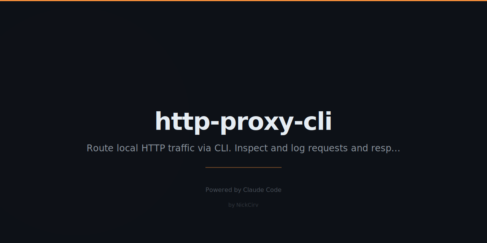

# http-proxy-cli

Local HTTP proxy with real-time request/response inspection, logging, and replay. Zero external dependencies.

```
TIME          METHOD   STATUS  MS     SIZE   PATH
12:34:01.123  GET      200     45ms   1.2KB  /api/users
12:34:01.456  POST     201     112ms  320B   /api/orders
12:34:01.789  DELETE   404     23ms   89B    /api/items/99
```

## Install

```bash
npm install -g http-proxy-cli
# or
npx http-proxy-cli start
```

Or clone and run directly:

```bash
git clone https://github.com/NickCirv/http-proxy-cli.git
cd http-proxy-cli
node index.js start
```

**Requirements:** Node.js 18+. No `npm install` needed — zero external dependencies.

## Usage

### Start a proxy

```bash
# Default: listen on :8080, forward to localhost:3000
http-proxy-cli start

# Custom port and target
http-proxy-cli start --port 9000 --target http://api.example.com

# Short alias
hproxy start --port 9000
```

### Inspect request/response bodies

```bash
http-proxy-cli start --inspect
```

Pretty-prints JSON bodies and text payloads in the terminal.

### Save requests to a log file

```bash
http-proxy-cli start --log requests.log
```

Logs are written in NDJSON format (one JSON object per line). Each entry includes method, path, status, timing, headers, and optionally bodies.

### Filter by path

```bash
http-proxy-cli start --filter /api
```

Only logs and displays requests whose path contains `/api`.

### Inject a header into all requests

```bash
http-proxy-cli start --inject-header "X-Debug: true"
http-proxy-cli start --inject-header "X-Request-Id: abc123"
```

Adds the specified header to every forwarded request.

### Replay logged requests

```bash
# Replay all requests in the log
http-proxy-cli replay requests.log

# Replay a specific request by index (0-based)
http-proxy-cli replay requests.log --index 3

# Replay against a different target
http-proxy-cli replay requests.log --target http://localhost:4000
```

### HTTPS CONNECT tunnel

HTTPS passthrough works automatically. Point your client at the proxy with `CONNECT` support and SSL handshakes tunnel through untouched.

## All Options

### `start`

| Flag | Default | Description |
|------|---------|-------------|
| `--port <n>` | `8080` | Proxy listen port |
| `--target <url>` | `http://localhost:3000` | Forward requests to this URL |
| `--inspect` | off | Pretty-print request and response bodies |
| `--log <file>` | — | Save requests as NDJSON to this file |
| `--filter <string>` | — | Only log paths containing this string |
| `--inject-header <h>` | — | Add this header to all requests (e.g. `"X-Debug: true"`) |

### `replay`

| Flag | Default | Description |
|------|---------|-------------|
| `--target <url>` | `http://localhost:8080` | Base URL to replay against |
| `--index <n>` | — | Replay only the entry at this index |

## Security

- `Authorization` headers are **automatically redacted** in terminal output: `Bearer eyJ0eXA... [redacted]`
- Log files contain **full header values** — protect them accordingly (add to `.gitignore`)
- The proxy **only binds to `127.0.0.1`** — not exposed on the network

## Log Entry Format

Each NDJSON line written to `--log` follows this schema:

```json
{
  "id": "uuid-v4",
  "timestamp": "2026-03-03T12:34:01.123Z",
  "method": "POST",
  "path": "/api/users",
  "status": 201,
  "durationMs": 112,
  "responseSize": 320,
  "requestHeaders": { "content-type": "application/json", "...": "..." },
  "responseHeaders": { "content-type": "application/json", "...": "..." }
}
```

When `--inspect` is enabled, `requestBody` and `responseBody` are also included.

## Examples

```bash
# Debug a local Next.js dev server
hproxy start --port 8888 --target http://localhost:3000 --inspect

# Capture only API calls during a test run
hproxy start --log test-run.log --filter /api

# Add a trace header to every request
hproxy start --inject-header "X-Trace-Id: $(uuidgen)"

# Replay the third captured request against staging
hproxy replay test-run.log --index 2 --target https://staging.example.com
```

## License

MIT
